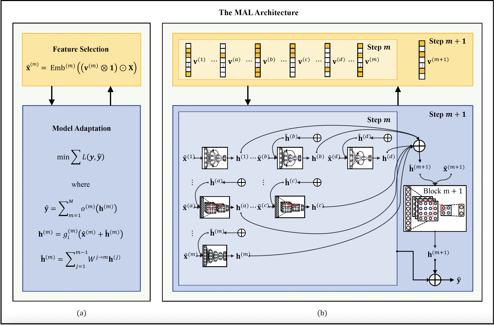

# Mutual Adaptable Learning
In real-world applications that involve complex data dependencies, it would be essential to proceed with machine learning tasks in an adaptable manner. We presents a novel Mutually Adaptable Learning (MAL) approach that allows for, on the one hand, extracting the most crucial information from data, and on the other hand, maximally utilizing it through model learning, in a mutually adaptable manner. We elaborate our MAL approach by explaining how it determines the necessity for the adaptation of both features and the learning model, integratively adapts between feature selection and model learning, and optimally achieves the learning objective




## Environment
- python==3.6.10
- torch==1.1.0

## Usage
```
python real_world_exp_flu.py --interconn 
``````